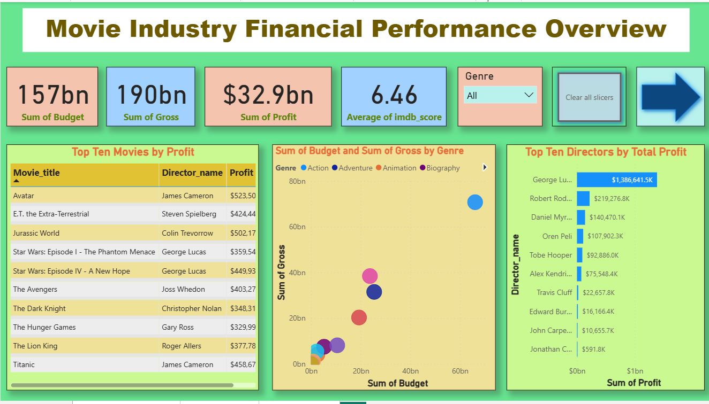
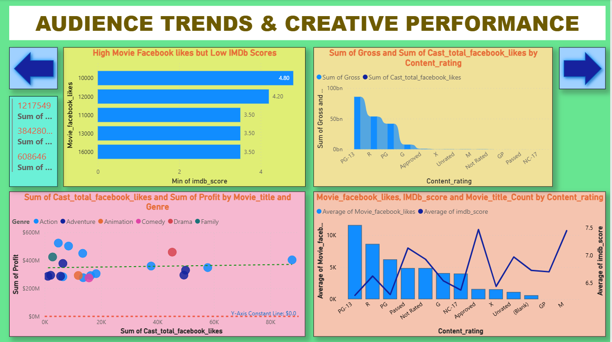
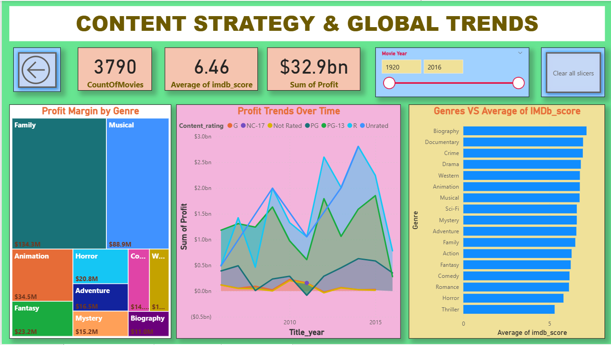

# Movie-Industry-Data-Analysis
## 1. Project Overview
This project is to analyze movie industry data to identify drivers of financial success and audience engagement. It delivers a comprehensive three-page Power BI business intelligence solution designed to decode the variables behind movie success by integrating financial metrics with social media engagement and critical sentiment. The objective of this project is to analyze a comprehensive IMDb dataset to uncover the relationship between financial investment, social media presence, and critical reception. The dashboard provides a three-page interactive experience to help stakeholders understand what makes a movie successful in the modern era.

## 2. Tools Used
•	Microsoft Excel 

•	Power BI 

## 3. Dataset
**•	Source:** IMDb Movie Metadata.

**•	Data contains:** Movie meta data contains 5044 rows and 28 columns.

  Columns include Movie title, Director name, Actors names, Facebook likes, Gross, Budget, Duration, Genres, Year, IMDb score etc.

## 4. Steps Followed
•	Cleaned data in Excel (e.g., removed blanks and duplicates, formatted columns,replaced missing values and non-printable characters)

•	Used Excel formulas and Power Query to clean the data

• Created custom columns for Profit ($Gross - $Budget), Profit Status, and Return on Investment(ROI= $Profit / $Budget)

•	Imported cleaned data into Power BI

•	Built dashboards using charts, slicers, and KPIs

## 5. Key Insights
**•	Quality vs. Popularity:** 
There is a notable "Fame Gap" where high Facebook likes do not always result in high IMDb scores.

**•	Efficiency:** 
Smaller budget genres like Horror often demonstrate a higher ROI compared to high-budget Action blockbusters.

**•	Market Break-even:** 
Using a constant line at 0 on the scatter plot helped identify that a significant portion of high-budget films fail to break even despite high social media
buzz.

**•	Director Influence:**
A small group of elite directors generates a disproportionate amount of industry wealth, proving that "brand-name" talent is the strongest predictor of high total profit.

**•	Demographic Digital Buzz:**
PG-13 and R-rated films dominate Facebook engagement, indicating that movie "hype" is almost entirely driven by younger, socially active audiences.

**•	Budget Efficiency:**
The data shows that high spending doesn't guarantee success; mid-budget genres like "Family" often achieve higher profit margins than expensive, high-risk Action blockbusters.

**•	Quality Stability:**
While industry profits fluctuate wildly over time, the average IMDb score remains remarkably stable at 6.46, showing that audience perception of quality is consistent regardless of market trends.

## 6. Screenshots 
 
**Screenshot 1: Financial Performance Overview Dashboard**

This dashboard provides a high-level summary of total industry health, tracking $32.9bn in total profit. It uses KPI cards and rankings to identify top-performing movies and directors, establishing the financial scale of the dataset. 

**Screenshot 2: Audience Trends & Creative Performance Dashboard**

This page explores the "Social Sentiment" of the industry. It maps the relationship between social media hype (Facebook Likes) and critical reception (IMDb Scores). It highlights that viral popularity (Hype) does not always correlate with high critical ratings or financial success. 

**Screenshot 3: Content Strategy & Global Trends Dashboard**

The final page analyzes long-term industry shifts and genre efficiency. By using a Treemap for Profit Margin and an Area Chart for trends over time, this dashboard identifies which types of content offer the best return on investment and how profitability has evolved through the decades.

## 7. Files Included 
•	“MiniProject-MovieMetadata.xlsx”– Original Dataset and Cleaned data

•	“MiniProject_MovieMetaData.pbix”– Power BI Dashboard

•	“README.md”– Project description 

 ## 8. How to Use 
•	Open “MiniProject-MovieMetadata.xlsx” to view the cleaned data. 

•	Open “MiniProject_MovieMetaData.pbix” in Power BI Desktop to explore the visuals.

•	Open “README.md” to understand the details about the project.

 
 
